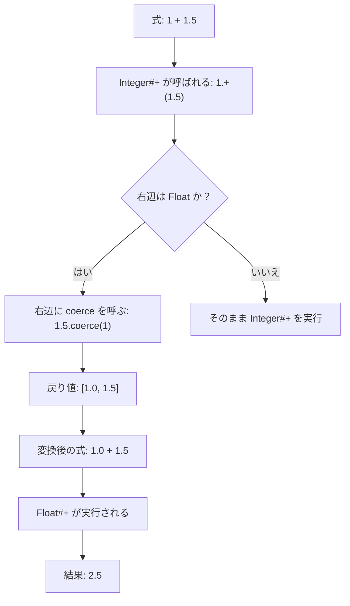

# すべてがオブジェクトであることのメリット・デメリット

## メリット

* **統一的に扱える**
  数値・文字列・配列など、すべてのデータをオブジェクトとして扱えるため、同じ操作体系で統一されている。
  例：`123.to_s`（数値を文字列に変換）、`"hello".upcase`（文字列を大文字化）

* **直感的で学びやすい**
  「データに対してメソッドを呼び出す」という一貫した考え方で済むため、初心者でも理解しやすい。

---

## デメリット

* **性能面で不利**
  `1 + 2` ですら内部的には `Fixnum#+`（Ruby）や `int.__add__`（Python）の呼び出しになる。
  C言語のような低レベル言語に比べると遅くなりやすい。

* **処理系が複雑化**
  すべてをオブジェクトとして扱うため、言語処理系の実装が重くなり、オーバーヘッドが生じやすい。

---

# 演算子の正体

Q. なぜ演算子の挙動を変えられるのか？（数値計算と文字列結合は全然違う処理のはずなのに）
A. Rubyにおける多くの演算子は「特別な構文」ではなく**メソッド呼び出しの糖衣構文**だからである。

* `1 + 2` は内部的に `1.+(2)` というメソッド呼び出しに変換される。
* `+` は単なる記号ではなく「特定のメソッド名に紐づいたシンタックスシュガー」である。
* `Integer` には `Integer#+`、`String` には `String#+` が実装されており、同じ演算子でも型によって挙動が変わる。

ゆえに、**動的型付け言語においては実行時解決が重要**となる。
変数にどの型が入るかは実行するまで確定せず、`a + b` が数値加算か文字列結合か、あるいはユーザー定義クラスの `#+` なのかは、実行時に受け手のクラスを見てメソッド探索によって決まる。
これは柔軟性の源泉であると同時に、オーバーヘッドの要因でもある。

---

# 型が異なる演算の例

```ruby
pry(main)> 1.class
=> Integer
pry(main)> 1.5.class
=> Float
pry(main)> 1 + 1.5
=> 2.5
```

Q. なぜ異なる型の計算が成立するのか？
A. 内部で `coerce` メソッドを利用して型を揃えてから演算しているからである。

* `1 + 1.5` を評価すると、まず `1.+(1.5)`（`Integer#+`）が呼ばれる。
* `Integer#+` は `Float` 相手に直接対応できないため、右辺に対して `coerce` を呼ぶ。
* `1.5.coerce(1)` が実行され、`[1.0, 1.5]` が返る。
* この変換結果を使って `1.0 + 1.5` が実行され、結果として `2.5` が返る。

補足：「coerce」の直訳は「強制する」「無理に〜させる」である。
右辺（`1.5`）が自分の世界（`Float`）のルールに左辺（`1`）を強制的に引き込む処理である。



